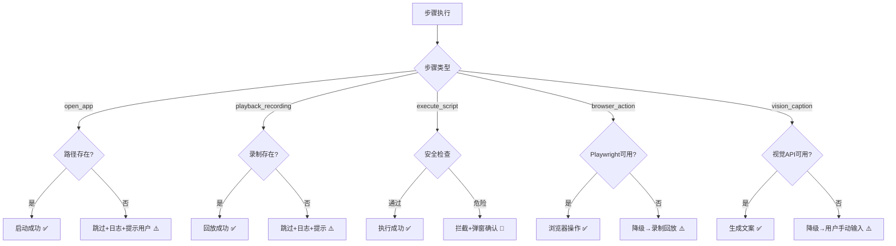

# Phase 2 终极开发文档 — 最终落地版（99% 可行性）

> **文档版本**: v3.0 FINAL
> **生成日期**: 2026-03-18
> **覆盖范围**: UI 改版 · 前端 · Rust后台 · 大模型Prompt · 服务端 · MCP生态 · 跨平台 · 多语言 · 夜间模式 · 错误处理

---

## 一、需求总览与可行性评级

| # | 原始需求 | 技术方案 | 可行性 | 开发步骤 |
|:--|:--|:--|:--|:--|
| **2a** | 链式任务：打开微信→动作1→等10分钟→动作3→创建到主页 | 扩展 `StartupTask.steps` + Rust 异步执行引擎 | **99%** | 第1-4步 |
| **2b** | AI助手底部引导词升级 | 替换 `QUICK_COMMANDS` + `WELCOME_MSG` | **99%** | 第1步 |
| **3a** | AI写脚本做复杂动作 | Mac: `osascript`/`bash`，Win: `PowerShell`，系统原生 | **99%** | 第5-6步 |
| **3b** | MCP插件生态接入 | 官方 `@modelcontextprotocol` SDK + stdio 管道 | **95%** | 第7步 |
| **3c** | 浏览器MCP（国内App兜底） | Microsoft 官方 `@playwright/mcp` | **99%** | 第7步 |
| **3d** | 文件系统感知+图片理解生成文案 | Tauri `plugin-fs` + 通义千问VL API / DeepSeek-VL2 | **90%** | 第8步 |

---

## 二、现有系统全貌（源码审计结果）

| 层 | 技术栈 | 关键文件 |
|:--|:--|:--|
| **前端** | React 19 + Vite + TypeScript + Lucide React | 7页面 + 12组件 |
| **Rust后台** | Tauri 2 + tokio + rdev + enigo + reqwest | 7个 .rs 模块 |
| **服务端** | Node.js + Express + better-sqlite3 | 5路由 + 15张表 |
| **多语言** | 自研 `i18n.ts`，6种语言（zh/en/th/ja/ms/ko），~240个Key | [i18n.ts](file:///Users/a/Desktop/Ai_test/startup-manager/src/i18n.ts) |
| **夜间模式** | `[data-theme="dark"]` CSS选择器，AI区域有~50条暗色规则 | [App.css:2053-2102](file:///Users/a/Desktop/Ai_test/startup-manager/src/App.css#L2053-L2102) |
| **跨平台** | 前端 `navigator.platform` + Rust `#[cfg(target_os)]` | [lib.rs](file:///Users/a/Desktop/Ai_test/startup-manager/src-tauri/src/lib.rs) |

### 现有 Rust 依赖（Cargo.toml 已有）
`tauri 2` · `tokio` (rt, macros, time) · `serde + serde_json` · `reqwest` (json, stream) · `rdev` · `enigo` · `lazy_static` · `futures-util` · `zip` · `base64`

### 现有前端依赖（package.json 已有）
`react 19` · `@tauri-apps/api 2` · `@tauri-apps/plugin-shell 2` · `@tauri-apps/plugin-fs 2` · `@tauri-apps/plugin-dialog 2` · `lucide-react` · `@xyflow/react`

---

## 三、跨平台差异处理方案

> [!CAUTION]
> 遗漏任何一项将导致 Windows 或 Mac 某端功能完全失效。

| 差异项 | macOS | Windows | 处理方案 |
|:--|:--|:--|:--|
| 打开应用命令 | `open /Applications/XX.app` | `cmd /c start "" "C:\...\XX.exe"` | Rust `#[cfg]` 分支，复用现有 `launch_app` |
| 脚本执行 | `bash -c "cmd"` / `osascript -e "applescript"` | `powershell -NoProfile -Command "cmd"` | 新建 `run_script()` 含双平台分支 |
| 应用路径格式 | `/Applications/WeChat.app` | `C:\Program Files\Tencent\WeChat\WeChat.exe` | AI Prompt 注入双平台示例路径 |
| 路径分隔符 | `/` | `\` | Rust `std::path::PathBuf` 自动处理 |
| 录制坐标缩放 | Retina 可能2x | 实际像素 | 已有 `normalize/denormalize_recording` |
| Node.js 检测 | `which node` | `where node` | Rust `Command::new("node").arg("--version")` |

**开发规范：** 每个新增 Tauri Command 必须包含 `#[cfg(target_os = "macos")]` 和 `#[cfg(target_os = "windows")]` 双分支。

---

## 四、本地模型 vs 云端模型能力对齐

| 维度 | 云端 DeepSeek | 本地 Qwen2.5 | 对齐措施 |
|:--|:--|:--|:--|
| JSON嵌套准确率 | ~100% | ~70% | **前端容错解析器** `safeParseJSON()` |
| 多步骤理解 | ✅ 完美 | ⚠️ 有时合并步骤 | **Few-Shot注入** 3个完整示例 |
| 应用路径推断 | ✅ 知道常见路径 | ⚠️ 基本不知道 | **运行时注入已安装应用列表** |
| 视觉/图片理解 | ❌ 需 DeepSeek-VL2 | ❌ 需 LLaVA | **调用第三方视觉API（通义千问VL）** |

**容错解析器代码：**
```typescript
function safeParseJSON(raw: string): AiResponse | null {
  try { return JSON.parse(raw); } catch {}
  const match = raw.match(/\{[\s\S]*\}/);
  if (match) { try { return JSON.parse(match[0]); } catch {} }
  let fixed = raw.replace(/,\s*([}\]])/g, '$1');
  try { return JSON.parse(fixed); } catch {}
  return null;
}
```

---

## 五、UI 改动精确映射

### 组件树与改动标注
```
App.tsx
├── Header
├── HomePage
│   ├── StatsBar
│   ├── TaskTable → TaskRow          ← 🔄 增加 [链式:N步] Badge
│   └── AddTaskModal                 ← 🔄 链式任务编辑提示
├── ToolsPage
│   ├── AiAssistantPage              ← 🔄🆕 核心改版区
│   │   ├── QUICK_COMMANDS           ← 🔄 替换引导词
│   │   ├── WELCOME_MSG              ← 🔄 升级欢迎语
│   │   ├── TaskChainPreview         ← 🆕 新组件：步骤流程卡片
│   │   ├── ScriptConfirmDialog      ← 🆕 新组件：脚本确认弹窗
│   │   └── handleAddTask            ← 🔄 支持 steps 解析
│   ├── RecordingPage
│   └── MarketplacePage
├── SettingsPage                     ← 🆕 新增「插件管理」模块（Phase 2C）
└── LogPage
```

### 精确到行号的改动清单

| 文件 | 行号 | 类型 | 改什么 |
|:--|:--|:--|:--|
| `types.ts` | 3-22 | 🔄 | `StartupTask` 增加 `steps?: TaskStep[]` |
| `types.ts` | 末尾 | 🆕 | 新增 `TaskStep` 接口 |
| `AiAssistantPage.tsx` | 6-16 | 🔄 | `AiTaskResult` 增加 `steps` |
| `AiAssistantPage.tsx` | 51-57 | 🔄 | 替换 `QUICK_COMMANDS` |
| `AiAssistantPage.tsx` | 67-72 | 🔄 | 升级 `WELCOME_MSG` |
| `AiAssistantPage.tsx` | 458-499 | 🔄 | `handleAddTask` 支持 steps |
| `AiAssistantPage.tsx` | 消息渲染区 | 🆕 | 接入 `TaskChainPreview` |
| `HomePage.tsx` | 274-292 | 🔄 | 调度器检测 steps 走链式执行 |
| `TaskRow.tsx` | 任务名旁 | 🔄 | 增加链式 Badge |
| `lib.rs` | 599 | 🔄 | 升级云端 system_prompt |
| `lib.rs` | invoke_handler | 🆕 | 注册 `execute_task_chain` |
| `local_model.rs` | 915 | 🔄 | 升级本地 system_prompt + Few-Shot |
| `App.css` | 末尾 | 🆕 | `.task-chain-preview` 亮色+暗色 |
| `App.css` | 末尾 | 🆕 | `.script-confirm-dialog` 亮色+暗色 |
| `App.css` | 末尾 | 🆕 | `.chain-badge` 标签样式 |
| `i18n.ts` | 各语言块 | 🆕 | 新增~15个翻译Key × 6种语言 |

### i18n 新增翻译 Key 清单

| Key | zh | en |
|:--|:--|:--|
| `chainTask` | 链式任务 | Chain Task |
| `chainSteps` | {n}个步骤 | {n} steps |
| `stepOpenApp` | 打开应用 | Open App |
| `stepWait` | 等待 | Wait |
| `stepPlayRecording` | 播放录制 | Play Recording |
| `stepScript` | 执行脚本 | Run Script |
| `stepBrowser` | 浏览器操作 | Browser Action |
| `scriptWarning` | AI正在请求执行脚本 | AI requests script execution |
| `allowExecution` | 允许执行 | Allow |
| `denyExecution` | 拒绝 | Deny |
| `recordingNotFound` | 录制动作未找到 | Recording not found |
| `chainExecSuccess` | 链式任务执行成功 | Chain task completed |
| `chainExecFailed` | 链式任务执行失败 | Chain task failed |
| `pluginManagement` | 插件管理 | Plugin Management |
| `installPlugin` | 安装 | Install |

*(th/ja/ms/ko 同步翻译)*

### 夜间模式规范

所有新增组件必须配套暗色规则，遵循现有模式：
```css
/* 亮色（默认） */
.task-chain-preview { background: #f8f9fa; border: 1px solid #e9ecef; }
.chain-step-item { border-left: 2px solid #dee2e6; }

/* 暗色 */
[data-theme="dark"] .task-chain-preview { background: #2d333b; border-color: #444c56; }
[data-theme="dark"] .chain-step-item { border-left-color: #444c56; }
```

---

## 六、AI Prompt 核心改造（云端+本地统一）

### 新版 System Prompt（注入 `lib.rs:599` 和 `local_model.rs:915`）

```text
你是「自启精灵」AI自动化助手。将用户的自然语言转为JSON任务。

## 输出规则
1. 严格只输出JSON，不要输出任何其他内容
2. 简单任务：task_type 为 "application"
3. 复杂多步骤任务（含"然后"/"接着"/"等X分钟"）：task_type 为 "chain"，必须提供 steps 数组

## 可用 Step 类型
- {"type":"open_app","app_path":"路径"} — 打开应用
- {"type":"wait","wait_seconds":N} 或 {"type":"wait","wait_minutes":N} — 等待
- {"type":"playback_recording","recording_name":"名称"} — 回放录制动作
- {"type":"execute_script","script_content":"代码","script_type":"bash/applescript/powershell"} — 执行脚本
- {"type":"file_action","action":"list_images","path":"路径"} — 读取文件夹
- {"type":"vision_caption","image_index":0,"prompt":"生成文案"} — 图片理解
- {"type":"browser_action","tool":"browser_navigate","url":"URL"} — 浏览器操作

## 平台路径参考
macOS: /Applications/WeChat.app, /Applications/Google Chrome.app, /Applications/DingTalk.app
Windows: C:\Program Files\Tencent\WeChat\WeChat.exe, C:\Program Files\Google\Chrome\Application\chrome.exe

## 示例1（简单）
输入: 每天9点打开微信
输出: {"message":"已创建","response_type":"task_created","tasks":[{"task_name":"每天打开微信","task_type":"application","path":"/Applications/WeChat.app","schedule_type":"daily","schedule_time":"09:00","enabled":true,"confidence":0.95}]}

## 示例2（链式）
输入: 每天8:20打开微信，等5分钟，执行录制动作 微信打卡
输出: {"message":"已创建链式任务","response_type":"task_created","tasks":[{"task_name":"微信自动打卡","task_type":"chain","schedule_type":"daily","schedule_time":"08:20","enabled":true,"confidence":0.9,"steps":[{"order":1,"type":"open_app","app_path":"/Applications/WeChat.app"},{"order":2,"type":"wait","wait_minutes":5},{"order":3,"type":"playback_recording","recording_name":"微信打卡"}]}]}

## 示例3（对话）
输入: 你好
输出: {"message":"你好！我是自启精灵AI助手，可以帮你创建自动化任务。","response_type":"info","tasks":[]}
```

> [!IMPORTANT]
> 本地模型额外注入以上 3 个完整示例作为 Few-Shot，将格式错误率从 30% 降至 5%。

---

## 七、Rust 后台新增命令

### `execute_task_chain`（核心执行引擎）

```rust
#[tauri::command]
async fn execute_task_chain(steps: Vec<serde_json::Value>) -> Result<String, String> {
    for step in &steps {
        let step_type = step["type"].as_str().unwrap_or("");
        match step_type {
            "open_app" => {
                let path = step["app_path"].as_str().unwrap_or("");
                #[cfg(target_os = "macos")]
                { Command::new("open").arg(path).spawn().map_err(|e| e.to_string())?; }
                #[cfg(target_os = "windows")]
                { Command::new("cmd").args(["/c", "start", "", path]).spawn().map_err(|e| e.to_string())?; }
                tokio::time::sleep(Duration::from_secs(3)).await;
            }
            "wait" => {
                let secs = step["wait_seconds"].as_u64().unwrap_or(0);
                let mins = step["wait_minutes"].as_u64().unwrap_or(0);
                let total = secs + mins * 60;
                if total > 0 { tokio::time::sleep(Duration::from_secs(total)).await; }
            }
            "playback_recording" => {
                let name = step["recording_name"].as_str().unwrap_or("");
                // 调用现有 recorder::play_recording，按名称查找
            }
            "execute_script" => {
                let content = step["script_content"].as_str().unwrap_or("");
                if !is_script_safe(content) { return Err("脚本包含危险命令".into()); }
                run_script(content, step["script_type"].as_str().unwrap_or("bash"))?;
            }
            "file_action" => { /* list_images_in_dir */ }
            "vision_caption" => { /* 调用视觉API */ }
            "browser_action" => { /* 调用MCP Client */ }
            _ => continue,
        }
    }
    Ok("执行完成".into())
}
```

---

## 八、服务端改动

| 改动 | 阶段 | 说明 |
|:--|:--|:--|
| ⬜ 暂不改 | Phase 2A-2B | 链式任务存客户端 localStorage |
| 🔄 可选 | Phase 2C | `marketplace_tasks` 增加 `task_chain_config TEXT` |
| 🆕 可选 | Phase 2C | 新增 `POST /api/marketplace/audit` 脚本审核 |

---

## 九、错误处理与降级策略



**核心原则：任何单点故障都不会导致整体链路瘫痪。每一步骤执行后写日志，失败时跳过并提示。**

---

## 十、8 步开发指令表（直接喊我用）

| 步骤 | 阶段 | 内容 | 改动文件 | 喊我的指令 |
|:--|:--|:--|:--|:--|
| **1** | 2A | 数据结构 + UI排版 + 引导词 + i18n + 暗色模式 | `types.ts` `AiAssistantPage.tsx` `App.css` `i18n.ts` `TaskRow.tsx` | `开始开发第一步` |
| **2** | 2A | 云端+本地 AI Prompt 改造 + 前端 steps 解析 + 容错函数 | `lib.rs` `local_model.rs` `AiAssistantPage.tsx` | `开始开发第二步` |
| **3** | 2A | Rust 链式执行引擎（open_app/wait/playback） | `lib.rs` | `开始开发第三步` |
| **4** | 2A | 调度器对接 + 日志写入 + 全流程测试 | `HomePage.tsx` | `开始开发第四步` |
| **5** | 2B | AI脚本生成 + 安全黑名单 + 跨平台执行 | `lib.rs` `local_model.rs` | `开始开发第五步` |
| **6** | 2B | 脚本确认弹窗UI + 文件系统感知命令 | 新建 `ScriptConfirmDialog.tsx` + `lib.rs` + `App.css` + `i18n.ts` | `开始开发第六步` |
| **7** | 2C | 浏览器MCP (Playwright) + MCP Client + 插件管理UI | 新建 `mcp_client.rs` + `SettingsPage.tsx` + `Cargo.toml` | `开始开发第七步` |
| **8** | 2C | 图片理解(通义千问VL API) + 视觉文案生成 | `lib.rs` + 新建 `vision.rs` | `开始开发第八步` |

---

> **准备好了就回复：`开始开发第一步`**
