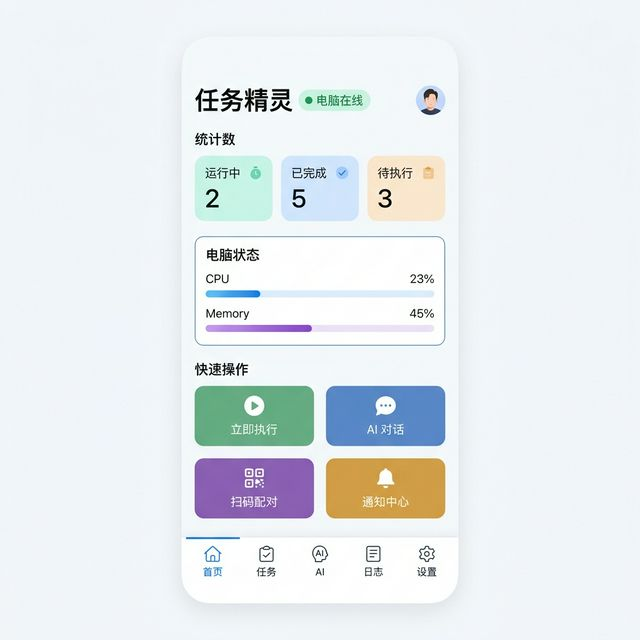
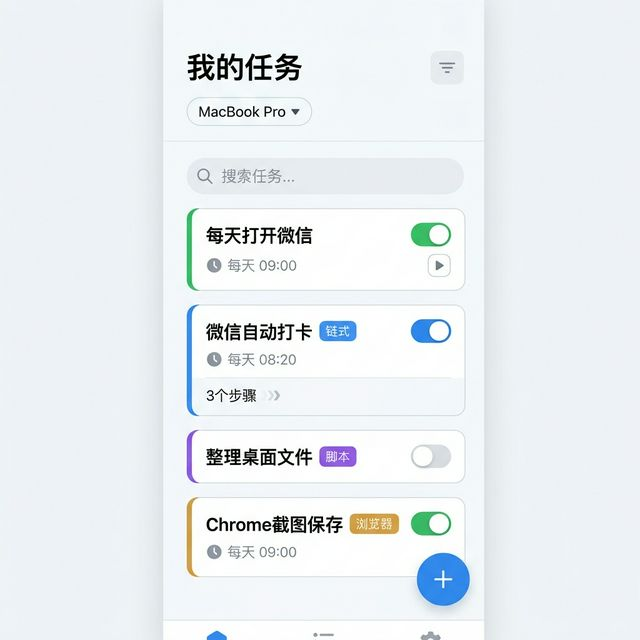
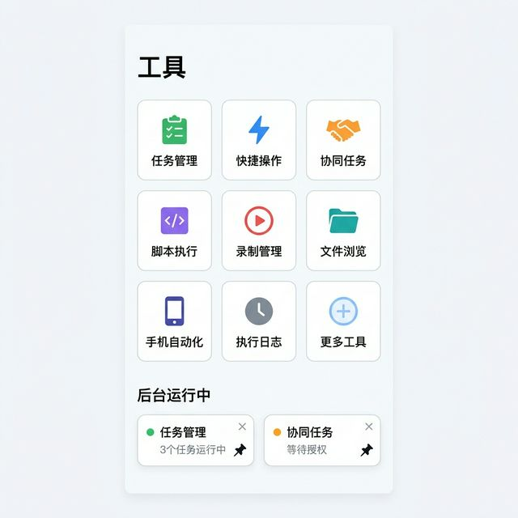
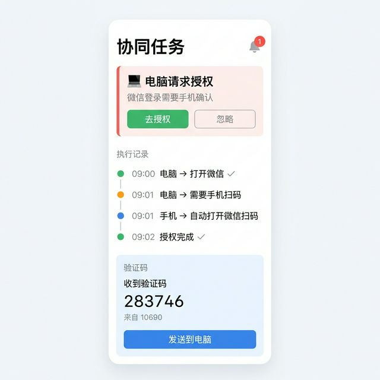

# 📱 任务精灵 手机版 — 开发文档（最终版）

> 版本: v1.0 | 日期: 2026-03-19 | 状态: 待开发

---

## 一、产品定位

手机是 **远程遥控器 + 协同执行器**，桌面端是 **主执行引擎**。

- 一个账号可绑定 **多台电脑**
- 手机自带 **本地小模型**，可独立执行手机端自动化
- 手机和电脑 **双向协同**（授权转发、验证码、任务同步）

```
📱 手机 App（一个账号）
├── 💻 MacBook Pro   🟢在线  WiFi局域网
├── 💻 公司台式机    ⚪离线
└── 💻 家里 Windows  ☁️云端中继
```

---

## 二、登录系统

与桌面端完全一致，复用现有服务器 `bt.aacc.fun:8888` API：

| 方式 | 说明 |
|:--|:--|
| 邮箱 + 密钥 | 账号密码登录 |
| 邮箱 + 验证码 | QQ邮箱 SMTP 发验证码 |

复用接口：`/api/auth/login`、`/api/auth/register`、`/api/auth/verify-code`

---

## 三、技术选型

| 层面 | 方案 | 理由 |
|:--|:--|:--|
| **框架** | Flutter 3.x | 自研渲染 60fps，Platform Channel 访问无障碍 |
| **UI 库** | Material 3 (Material You) | 自适应主题，暗色模式开箱即用 |
| **通信** | WebSocket + REST | 实时控制 + 可靠同步 |
| **推送** | FCM (Android) + APNs (iOS) | 任务完成通知 |
| **状态管理** | Riverpod | Flutter 推荐 |
| **多语言** | flutter_intl + ARB | 中/英文，与桌面端 `i18n.ts` 对齐 |

### 关键依赖包

| 包名 | 用途 |
|:--|:--|
| `web_socket_channel` | WebSocket 通信 |
| `flutter_blue_plus` | 蓝牙 BLE |
| `local_auth` | 指纹 / Face ID |
| `flutter_local_notifications` | 本地推送 |
| `permission_handler` | 权限管理 |
| `flutter_slidable` | 卡片滑动操作 |
| `fl_chart` | CPU/内存图表 |
| `flutter_intl` | 国际化 i18n |

### Flutter vs React Native 对比

| 维度 | Flutter | React Native |
|:--|:--|:--|
| 渲染 | 🏆 Skia 直绘 60fps | Bridge 调原生 |
| 启动速度 | 🏆 ~300ms | ~500ms |
| 底层 API | 🏆 Platform Channel | 需桥接 |
| 包大小 | ~15MB | 🏆 ~8MB |
| 代码复用 | Dart | 🏆 复用 React/TS |

> 性能差距 <5%，选 Flutter 因无障碍等底层能力更灵活。

---

## 四、通信方式

| 方式 | 条件 | 延迟 | 状态图标 |
|:--|:--|:--|:--|
| **WiFi 局域网** | 同路由器 | <5ms | 🟢 绿色 WiFi |
| **蓝牙 BLE** | 无网络 | ~50ms | 🟠 蓝牙图标 |
| **WiFi Direct** | 无路由器 | ~10ms | 🟣 紫色 WiFi |
| **云端中继** | 不同网络 | ~200ms | ☁️ 云朵图标 |
| **离线** | 无连接 | — | ⚪ 灰色断开 |

> 无网络时优先蓝牙 BLE（低功耗自动配对），备选 WiFi Direct。

---

## 五、功能清单

### P0 核心

| 功能 | 手机端 | 桌面端 |
|:--|:--|:--|
| 任务列表 | 查看/编辑/开关/删除 | 同步状态 |
| 立即执行 | 一键触发任意任务 | 执行+返回结果 |
| AI 对话 | 发指令（文字/语音/图片） | 解析+执行 |
| 多设备管理 | 切换控制哪台电脑 | 心跳上报 |
| 推送通知 | 接收执行结果 | 上报结果 |
| 远程启动 App | 手机端启动电脑应用 | 调 `launch_app` |

### P1 协同自动化

| 功能 | 说明 |
|:--|:--|
| 授权转发 | 电脑微信登录 → 手机自动确认 |
| 验证码转发 | 手机收短信 → 提取验证码 → 发给电脑 |
| 手机自动化 | 无障碍服务模拟点击/滑动（Android） |
| 脚本执行 | 手机发脚本 → 电脑执行+返回输出 |
| 录制管理 | 查看/触发/删除录制 |

### P2 高级

| 功能 | 说明 |
|:--|:--|
| 语音控制 | 语音 → AI → 自动执行 |
| 安全锁 | 敏感操作需指纹/Face ID |
| 多电脑同步 | 任务跨设备分发 |
| 插件市场 | 远程浏览/安装技能包 |

---

## 六、跨设备协同场景

### 场景1：电脑微信需手机授权
```
电脑打开微信 → 检测到扫码页 → 发送任务给手机
→ 手机自动打开微信 → 无障碍点击"确认登录" → 回报完成
```

### 场景2：电脑需要验证码
```
电脑发任务：需要验证码 → 手机监听短信通知
→ 提取验证码 283746 → 发送给电脑 → 电脑自动填入
```

### 场景3：手机远程创建任务
```
手机 AI 对话："每天9点打开钉钉" → 同步到指定电脑
→ 电脑添加到调度器 → 回报确认
```

---

## 七、WebSocket 消息协议

```json
// 手机 → 电脑：执行任务
{"type":"task_execute","device_id":"xxx","task_id":"yyy"}

// 手机 → 电脑：AI 对话
{"type":"ai_chat","device_id":"xxx","message":"打开微信","model":"deepseek_cloud"}

// 电脑 → 手机：执行结果
{"type":"result","task_id":"yyy","success":true,"output":"已完成"}

// 电脑 → 手机：请求授权
{"type":"auth_request","app":"微信","action":"confirm_login"}

// 手机 → 电脑：验证码
{"type":"sms_code","code":"283746","from":"10690"}

// 电脑 → 手机：心跳
{"type":"heartbeat","cpu":23,"memory":45,"tasks_running":1}
```

---

## 八、页面结构（4 Tab）

```
┌─────┬─────┬─────┬─────┐
│ 🏠   │ 🤖   │ 🛠   │ 👤   │
│ 首页  │ AI   │ 工具  │ 我的  │
└─────┴─────┴─────┴─────┘
```

### 🏠 首页（设备概览）
- 设备卡片横向滑动（设备名 + 通信图标 + CPU/内存）
- 今日统计（运行中/已完成/待执行）
- 最近执行记录（简要时间线）
- 锁定的工具卡片（从工具页📌过来的）

### 🤖 AI（智能助手）
- 对话界面（文字 / 语音 / 图片）
- 模型切换（云端 / 手机本地小模型 / OpenClaw）
- 远程创建任务（AI 生成 → 同步到指定电脑）

### 🛠 工具（小程序风格 3×4 网格）

每个工具像微信小程序一样，点击打开，底部有"后台运行中"区域，可📌锁定到首页。

```
┌──────────┬──────────┬──────────┐
│ 📋 任务  │ ⚡ 快捷  │ 🤝 协同  │
│ 管理     │ 操作     │ 任务     │
├──────────┼──────────┼──────────┤
│ 💻 远程  │ 📝 脚本  │ 🎬 录制  │
│ 启动     │ 执行     │ 管理     │
├──────────┼──────────┼──────────┤
│ 📂 文件  │ 📱 手机  │ 🧠 模型  │
│ 浏览     │ 自动化   │ 管理     │
├──────────┼──────────┼──────────┤
│ 📊 执行  │ 🔌 插件  │ ➕ 更多  │
│ 日志     │ 市场     │ 工具     │
└──────────┴──────────┴──────────┘

后台运行中:
● 任务管理 (3个运行中) 📌 ×
● 协同任务 (等待授权)  📌 ×
```

### 👤 我的
- 登录 / 注册
- 设备管理（配对 / 通信方式 / 删除）
- AI 模型设置（云端 API Key + 手机本地小模型下载/管理）
- 外观（亮色 / 暗色 / 跟随系统）
- 语言（中文 / English）
- 安全设置（指纹锁、自动授权开关）
- 关于 / 帮助

---

## 九、UI 设计稿（扁平化 Material 3）

### UI 风格规范

| 属性 | 值 |
|:--|:--|
| 风格 | 扁平化 Material 3 |
| 主色 | `#3b82f6` 蓝（与桌面端一致） |
| 背景 | 浅灰 `#f8f9fb`，卡片 `#ffffff` |
| 圆角 | 12px 统一 |
| 字体 | 系统默认（iOS: SF Pro, Android: Roboto） |
| 暗色 | Material 3 `ColorScheme.fromSeed()` 自动生成 |
| 动画 | Material Motion（共享元素 + 淡入淡出） |
| 图标 | Material Symbols Outlined |

### 首页


### 任务列表


### 工具页（小程序网格 + 后台运行）


### 协同任务


---

## 十、功能覆盖排查

### 桌面端 7 页面 → 手机端 4 Tab 映射

| 桌面页面 | 手机对应 | 状态 |
|:--|:--|:--|
| HomePage（任务管理） | 🛠工具→任务管理 | ✅ |
| AiAssistantPage（AI对话） | 🤖AI Tab | ✅ |
| RecordingPage（录制） | 🛠工具→录制管理 | ✅ 查看+回放 |
| SettingsPage（设置） | 👤我的 | ✅ |
| LogPage（日志） | 🛠工具→执行日志 | ✅ |
| ToolsPage（模型管理） | 👤我的→AI模型设置 + 🛠工具→模型管理 | ✅ |
| MarketplacePage（插件） | 🛠工具→插件市场 | ✅ |

### 已识别风险及解决方案

| 问题 | 解决方案 |
|:--|:--|
| 电脑离线时发任务 | 离线队列：手机缓存，电脑上线后自动同步 |
| 手机图片→电脑分析 | WS 传 base64 → 电脑保存后调 Vision API |
| 蓝牙传大文件慢 | 压缩+分块传输，或提示切 WiFi |
| 多电脑消息路由 | WS 消息加 `device_id`，电脑注册唯一 ID |
| Android 后台杀进程 | 前台通知保活 + 电池优化白名单引导 |
| 验证码安全 | 只转发含"验证码"关键词的短信 |

---

## 十一、桌面端需新增

| 改动 | 说明 |
|:--|:--|
| WebSocket Server | `lib.rs` 新增，监听 `ws://0.0.0.0:19527` |
| 设备配对 | 二维码配对（含 token），防止未授权连接 |
| 心跳上报 | CPU / 内存 / 任务状态 |
| 中继 API | `server/src/routes/relay.ts` 外网中继 |

---

## 十二、开发阶段

| 阶段 | 内容 | 预估 |
|:--|:--|:--|
| **M1** | Flutter 搭建 + 登录（邮箱+密钥/验证码） + 桌面端 WS Server + 二维码配对 + 任务列表 + 远程执行 | 5天 |
| **M2** | AI 对话（云端+本地模型） + 远程创建任务 + 推送通知 | 5天 |
| **M3** | 手机自动化（无障碍服务） + 验证码转发 + 授权协同 | 5天 |
| **M4** | 蓝牙 BLE + WiFi Direct + 多设备切换 + 暗色模式 + 多语言 | 5天 |
| **M5** | 语音控制 + 安全锁（指纹/Face ID） + 插件市场 | 5天 |

---

> 📋 本文档为任务精灵手机版最终开发规范，涵盖产品定位、技术选型、通信方案、功能清单、UI规范、协议定义及开发计划。
