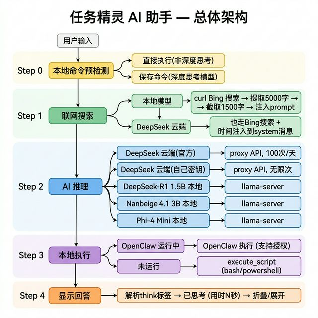
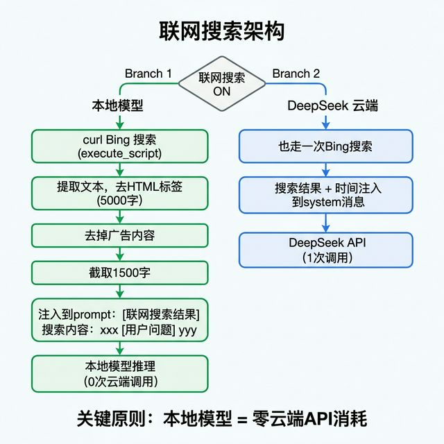
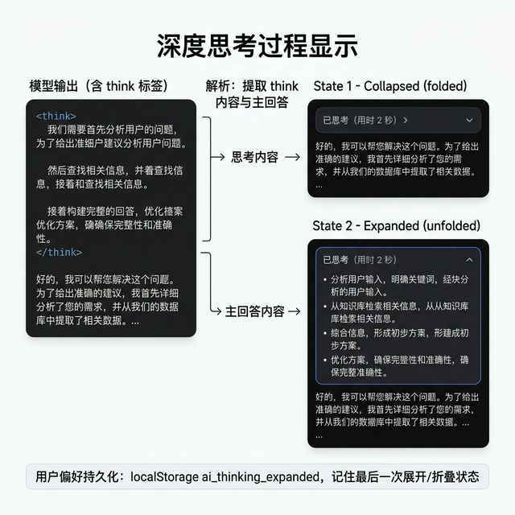

# 任务精灵 AI 助手 — 完整架构图

## 1. 总体架构

---

## 2. 联网搜索架构

---

## 3. 深度思考过程显示

---

## 4. 五种 AI 模型路径

| # | 模型 | 类型 | 入口 | API 消耗 | 思考过程 |
|---|------|------|------|----------|---------|
| 1 | DeepSeek 云端（官方） | 云端 | bt.aacc.fun:8888/api/deepseek/chat | ✅ 每日 100 次 | ✅ 需要 |
| 2 | DeepSeek 云端（自己密钥） | 云端 | 同上, model: deepseek_user | ❌ 无限次 | ✅ 需要 |
| 3 | DeepSeek-R1 1.5B | 本地 | 127.0.0.1:8089/v1/chat/completions | ❌ | ✅ `<think>` |
| 4 | Nanbeige 4.1 3B | 本地 | 同上 | ❌ | ✅ `<think>` |
| 5 | Phi-4 Mini | 本地 | 同上 | ❌ | ✅ `<think>` |

## 5. 关键原则

- **本地模型 = 零云端 API 消耗**
- **联网搜索**: curl Bing → 提取 5000 字 → 去广告 → 截取 1500 字 → 注入 prompt
- **DeepSeek 云端 + 联网**: 也走 Bing 搜索 + 时间注入
- **思考过程**: 所有 5 种模型都显示「已思考（用时 N 秒）」折叠/展开
- **偏好持久化**: localStorage 记住展开/折叠状态
