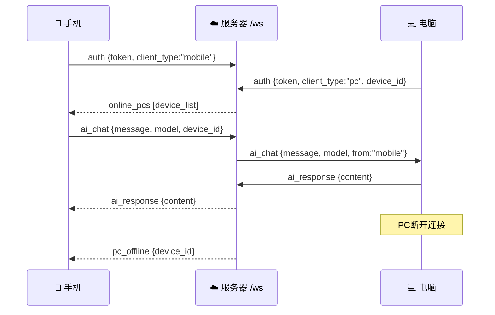

# Phase 2: 手机版 AI 助手 + WebSocket 中继

## 1. 手机端 AI 页面

重写 [ai_page.dart](file:///Users/a/Desktop/Ai_test/task-wizard-mobile/lib/pages/ai_page.dart)（804 行）

| 功能 | 说明 |
|------|------|
| 设备选择器 | 底部面板选择电脑，显示 🟢在线/⚪离线 |
| 模型面板 | 5个模型，标签"**电脑本地**"/"官方"/"自己" |
| 三开关 | 深度思考·智能搜索·本地执行 |
| 离线置灰 | 电脑离线 → 开关灰色禁用 + 本地模型🔒 |

````carousel

<!-- slide -->

````

---

## 2. 服务端 WebSocket 中继

新建 [ws_relay.ts](file:///Users/a/Desktop/Ai_test/server/src/ws_relay.ts)（305 行）



| 消息类型 | 方向 | 用途 |
|----------|------|------|
| `auth` | 双向→服务器 | JWT认证，区分 pc/mobile |
| `ai_chat` | 手机→PC | AI对话中转 |
| `ai_response` | PC→手机 | AI回复转发 |
| `switch_model` | 手机→PC | 远程切换模型 |
| `toggle_feature` | 手机→PC | 远程开关(深度思考等) |
| `pc_online/pc_offline` | 服务器→手机 | 实时在线通知 |

---

## Git Commits

| Commit | 说明 |
|--------|------|
| `211a044` | feat: Phase 2 手机版 AI 助手页面 |
| `26cd865` | feat: 服务端 WebSocket 中继服务 |

> [!WARNING]
> 部署到服务器前需执行 `npm install ws` 安装依赖
